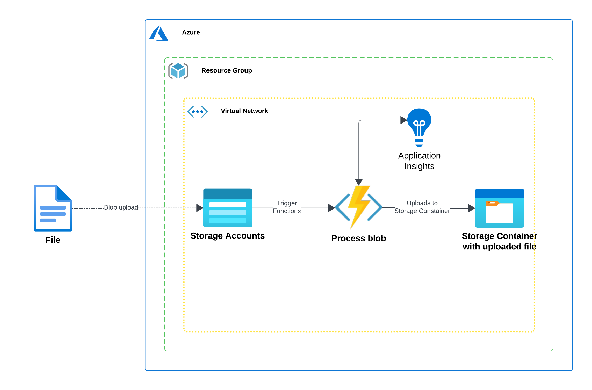
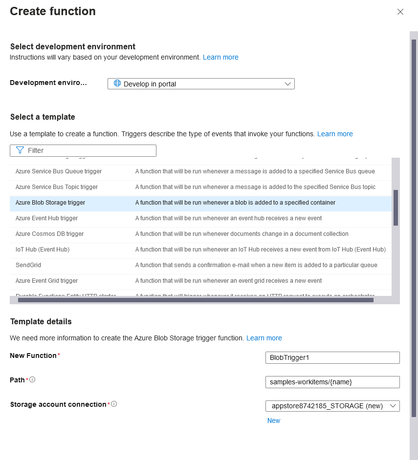
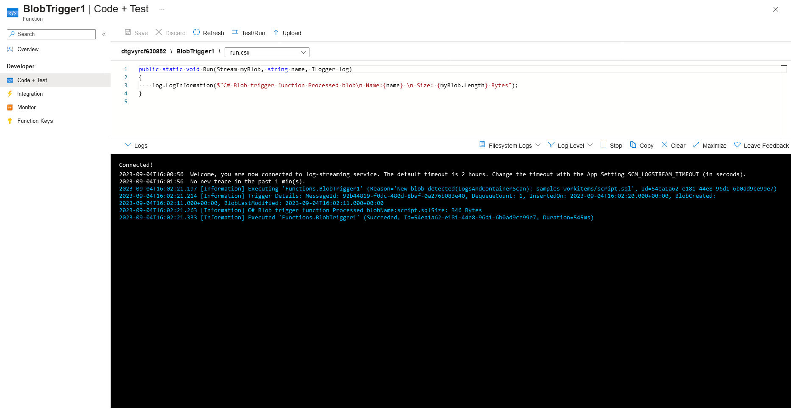

# Introduction

This document outlines the process of creating an Azure Function with a Blob trigger. This setup allows the Function to process files uploaded to a specific container within a Storage Account.

## Table of Contents
- [Introduction](#introduction)
- [Architecture](#architecture)
- [Prerequisites](#prerequisites)
- [Steps to Create and Configure the Azure Function](#steps-to-create-and-configure-the-azure-function)
  - [1. Create an Azure Function App](#1-create-an-azure-function-app)
  - [2. Enable Application Insights](#2-enable-application-insights)
  - [3. Add a Blob Trigger Function](#3-add-a-blob-trigger-function)
  - [4. Configure Blob Trigger Settings](#4-configure-blob-trigger-settings)
  - [5. Test the Function](#5-test-the-function)
  - [6. Check Logs](#6-check-logs)
- [Conclusion](#conclusion)

## Architecture

The following diagram illustrates the architecture of the solution:

*Figure 1: Solution Architecture*

## Prerequisites
Before you begin, ensure you have the following:
- An active Azure subscription.
- Access to the Azure Portal.
- A Storage Account created in Azure.

## Steps to Create and Configure the Azure Function

Follow these steps to set up your Azure Function with a Blob trigger:

### 1. Create an Azure Function App
First, create a new Function App resource in the Azure portal.

### 2. Enable Application Insights
During the Function App creation or afterwards, remember to enable `Application Insights` for monitoring and logging.

### 3. Add a Blob Trigger Function
Once the Function App is created, navigate to it and add a new function. Select the `Blob Trigger` template.

*Figure 2: Create Blob Trigger Function Page*

### 4. Configure Blob Trigger Settings
When configuring the Blob Trigger:
-   **Container Name**: Correctly set the name of the container in your Storage Account that the trigger will monitor.
-   **Path (File Name Pattern)**: Set the path to `{file}`. This configuration ensures that any file uploaded to the specified container will trigger the function.
-   **Storage Account Connection**: Create a new Storage Account connection or select an existing one, pointing to the Storage Account containing your target blob container.

> **Important:**
> - Ensure the container name is accurately specified.
> - Using `{file}` as the file name pattern allows the function to be triggered by any uploaded file in the container.
> - Verify that the Storage Account connection string is correctly configured and has the necessary permissions.

### 5. Test the Function
Upload a file to the container you specified in the Blob Trigger configuration. This action should trigger the function.

### 6. Check Logs
You can monitor the function's execution and check for logs:
1.  Navigate to your function in the Azure Portal.
2.  Go to the `Code + Test` section.
3.  In the console, switch the log view to `Filesystem Logs` to see the detailed execution logs.

*Figure 3: Filesystem Logs View*

> **Log Output Example:**
> The logs will show entries indicating that the function was triggered by the blob upload and processed it.

## Conclusion
As demonstrated, uploading a blob to the configured container successfully triggers the Azure Function, which then processes the blob. The execution logs can be easily accessed and reviewed through the Azure Portal.

